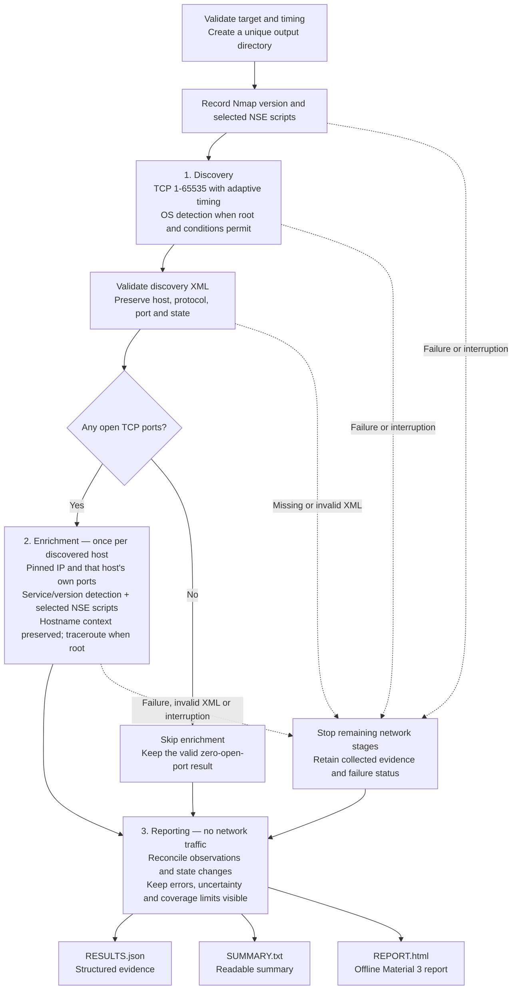

# 🔱 Nmap Cascade

An accuracy-first IPv4/TCP scanner with two network stages and a reporting stage.



Nmap writes raw TXT/XML/GNMAP artifacts during the network stages; only XML feeds
the next stage. Partial reports are finalized when the process and filesystem
still allow it. A completed process is not a claim that the target is vulnerability-free.

The Bash entrypoint runs Nmap; a small Python standard-library helper reads XML.
Each host keeps its own port list. A host discovered with port 22 does not inherit
another host's port 443. Discovery addresses are pinned for enrichment.

## Requirements and usage

- Bash 4.4+, Python 3.8+, Nmap 7.0+, and standard Unix utilities (`mktemp`, `tee`, `sed`).
- Keep `cascade_report.py` and `report_html.py` beside `nmap-cascade.sh`.
- Root enables SYN scanning, OS detection, and traceroute. Without root, TCP
  connect scanning works and skipped capabilities are recorded.

```bash
chmod +x nmap-cascade.sh
sudo ./nmap-cascade.sh
# Or, without OS detection/traceroute:
./nmap-cascade.sh
```

Prompts request a scan name, timing (`T0`–`T5`; Enter selects `T3`), and one IPv4
address, DNS hostname, or IPv4 CIDR. IPv6, target lists, hostname/CIDR combinations,
and Nmap's octet-range syntax are not supported and are rejected before scanning.
Run from the directory where you want the results saved.

Nmap controls its own adaptive rate and retries by default. Explicit overrides
remain available and are recorded in the report:

```bash
MIN_RATE=750 MAX_RETRIES=2 ./nmap-cascade.sh
# With root, pass overrides through sudo explicitly:
sudo env MIN_RATE=750 MAX_RETRIES=2 ./nmap-cascade.sh
```

`MIN_RATE` must be a positive decimal number and `MAX_RETRIES` a nonnegative
integer. These settings trade discovery accuracy for speed. A port missed in
discovery is not recovered by scanning only the discovered ports later.

## What the stages do

**Discovery:** scans TCP 1–65535 with `-Pn`, retaining non-open states in XML.
`-Pn` prevents a ping-only gate from excluding hosts; a `user-set` up status is
not proof of a response. Root scans include `-O --osscan-limit`, so OS detection
has access to both open and closed ports from the same invocation. Hosts that
lack suitable ports may have no OS result. A successful scan with no open TCP
ports produces a report and skips enrichment.

**Enrichment:** runs `-sV --version-all` and this NSE selection together:

```text
(default or vuln) and safe and not external and not intrusive
```

The installed script list is captured with `--script-help` before scanning.
Selection does not prove that every script ran: Nmap's applicability rules still
apply. The policy deliberately excludes external, intrusive, and non-safe checks;
`safe` is a Nmap category, not a guarantee of harmlessness or accurate findings.
Automatic version-detection scripts remain part of `-sV`. Native version-probe
exclusions, including TCP 9100, remain in effect.

For DNS hostname inputs, enrichment connects to the discovered IP and passes the
validated name as `http.host` and `tls.servername`. These arguments preserve
application context for scripts that support them, not every version probe.
Only the requested hostname is covered, not all virtual hosts. Hostname resolution
uses Nmap's default IPv4 selection; it does not enumerate every A/AAAA record.

**Reporting:** retains per-host observations, state reasons, service detection
method/confidence, script output and nested XML, OS accuracy, and traceroute.
Explicit aggregate port lists are reconciled; older single-state aggregates are
attributed only when their count exactly matches the missing requested ports.
Ambiguous aggregates stay unknown. Earlier observations remain available.

The report distinguishes script-reported evidence, version associations, and
explicit script errors. It never promotes a CVE/version association to an
independently confirmed vulnerability. Script-reported negative states apply only
to that check. Missing output is **unknown**, not “not vulnerable”. A completed
Nmap process is not proof of complete vulnerability coverage.

## Results and failure behavior

```text
nmap_<name>_<timestamp>_<unique-suffix>/
├── <name>_phase-1.{txt,xml,gnmap}
├── <name>_phase-2_<IPv4>.{txt,xml,gnmap}  # one set per enriched host
├── *.stdout.log / *.stderr.log
├── script-selection.xml
├── nmap-version.txt
├── run.json / events.jsonl / jobs.tsv
├── RESULTS.json                         # schema_version: 1
├── SUMMARY.txt
└── REPORT.html                          # offline Material 3 presentation
```

XML is the only machine-readable scan input; TXT and GNMAP are retained for
inspection. `RESULTS.json` contains run metadata, selected scripts, phase statuses
and commands, host observations, state changes, counts, limitations, and errors.
Counts distinguish discovered host/port endpoints from unique TCP port numbers.
Latest observed counts use completed observations; failed-scan evidence is retained
but not promoted to completed results.

`REPORT.html` is generated automatically at the end of successful, empty, failed,
and interrupted runs whenever reporting can complete. The terminal prints its
path. Open it directly in a browser: it contains its own CSS and needs no server,
JavaScript, CDN, or internet connection. Its Material 3 color roles, typography,
rounded surfaces, and status chips support system light/dark appearance and
mobile layouts. Expand observations and script evidence to inspect details;
the browser's print command uses a print stylesheet.

The HTML view uses the same evidence model as JSON, including partial execution,
unconfirmed findings, OS match accuracy, and coverage limitations. Scan-provided
text is HTML-escaped, and a restrictive Content Security Policy blocks active
content. The HTML itself is portable; keep the output folder together when sharing
if you also want its relative JSON, text, and source-XML links to work.

Failures stop further network stages and preserve the Nmap exit code. XML
validation failures use exit 65; log-capture failures use exit 74 when Nmap itself
succeeded. SIGINT/SIGTERM stop the active Nmap child and
produce partial reports with exit 130/143. A remaining host may be `not_started`;
it is never labeled tested-negative. Truncated XML stays available as a raw
artifact, with a parse error in the report. Well-formed error XML retains its
collected observations. SIGKILL, power loss, or an unwritable/full filesystem can
prevent finalization; existing raw files and the event log remain the recovery
source. Unique directories prevent same-second runs from mixing evidence.

Compatibility: phase 3 is now reporting, so no new `phase-3` scan files are
created. Phase-2 files are host-specific. Consumers of the old flat filenames or
summary counts must switch to the documented outputs above. UDP and IPv6 remain
outside coverage.

## Offline checks

```bash
bash -n nmap-cascade.sh
python3 tests/test_cascade.py
```

Tests run the real wrapper and XML/reporting code with a temporary fake Nmap.
They cover host separation, empty and malformed results, aggregate states,
failure/interruption, input validation, and evidence retention without scanning
any target. Detection recall and performance still require a controlled network
lab; mocked results cannot establish either.
